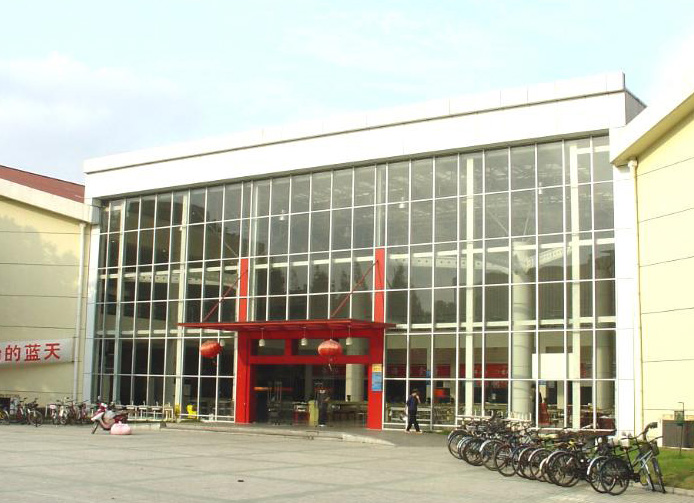
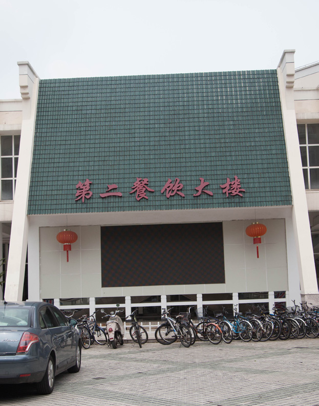
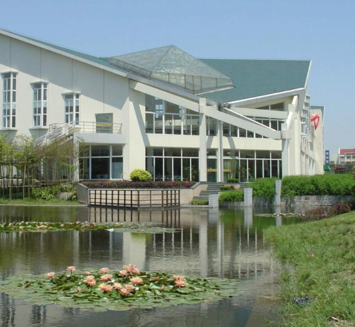

# 交大餐厅

## 第一餐饮大楼
距离西区教学楼最近的餐饮大楼,每到中午必定人满为患。一楼品种比较多,有普通的盒饭,也有各式小吃、馄饨、拉面。二楼是教工餐厅,味道比一楼好一些。煎饼果子和豆饮被无数学子奉为心头大爱。一餐楼层高,采光好,经常能与小鸟共进午餐。

## 第二餐饮大楼
从正门进来,首先是小吃广场,每时每刻都人满为患。主要有川味小吃,担担面之类;上海小吃,小笼包生煎之类;还有印度飞饼、各种煲、饭、麻辣烫。另外,这里的早餐是全交大最好吃的。往右走,会看见一家西餐厅,性价比不高。靠出口处,有一家微型咖啡店,出售饮料、冰激凌。对面是另一家西餐厅,小贵但味道不错。二楼有大众餐厅 , 新疆餐厅和教工餐厅。教工餐厅不贵又好吃。新疆餐厅好吃的很多,比如小盘鸡、孜然羊肉、鱼头汤等,喜欢吃肉的一定要去哦。三楼有盒饭,也有黄焖鸡、铁板烧,另外三楼有卖冰饮。

## 第三餐饮大楼
距离东 2 区宿舍最近的餐饮大楼。边上有小桥流水荷花池,景色宜人。楼下有家环境优美的小资咖啡厅。三餐也分为两层。一楼还有一个面馆,陕西风味的。主打是一个酸酸的辣辣的面。二楼装修清新采光好。有特色的是土耳其烤肉饭,在去年交大美食评选中荣获第一;其他的还有火锅、铁板烧、煲汤等。其实二楼的盒饭本身味道就不错,就是集油辣咸于一身。

## 第四餐饮大楼
四餐在西区,偏远,但凭着足够好吃这一点,还是有大批学子愿意驱车前往。一楼有很多小吃,拉面、土豆粉、炒饭、火锅、老鸭粉丝汤等等。二楼强推大众餐厅。大众餐厅里有很多好吃的,烤鸭饭、笼仔饭、烤鱿鱼、石锅饭、蒸饺、麻辣香锅、担担面......真的是吃一个月不带重样的!另外,二楼还有一家吉姆利得西餐厅。价钱和萨莉亚差不多,味道普通。

## 第五餐饮大楼
距离电院裙楼最近的餐饮大楼。确切说来,它不是一个餐厅,而是由许多餐厅组成的。

### 五餐自助餐厅
普通的大众餐厅。分为两层楼。鹌鹑蛋出现的频率较高。笑缘美食:这是 15 年新开的餐厅。餐厅不大,人多。最有特色的就是机器人刀削面。

### 东湖面馆
虽然叫面馆,不过我觉得最出名的不是面噢,而是各种煲!烤鱼煲、肥牛煲、宫保鸡丁煲等等。鸭腿饭、瓦罐汤也是那里的大热。另外,五餐也有个吉姆利得,以及一个死贵的小西餐厅。

## 第六餐饮大楼
六餐处在百分之九十九的本科生不会
涉足的区域。掩映在一群实验室之中,
六餐坐落在离庙门不远的地方。如果
你要去六餐吃饭的话,强推你在一个
晴天的傍晚,和小伙伴骑着自行车去
那里吃晚餐。天空中的晚霞绝对值回
你这十分钟的减肥之旅。
六餐边上还有一个叫伊诺简餐的小餐
厅,餐厅在二楼,主要是蛋包饭和一
些西式简餐。同样地,在傍晚时分登
上楼梯,看看这光线勾勒下的大好河
山,感叹一下在交大读书真是前世修
来的福气。
所以说,在六餐吃的不是饭,是情怀。

## 哈乐餐厅
哈乐餐厅在一餐对面。哈乐是为(惟)
数(一)不(一)多(个)有本帮菜
的餐厅。里面的爆鱼面可好吃了,直
接跟阿姨说给我来两块爆鱼也是可以
的。另外,这里还有土豆泥、鱼片、
咖喱饭等,选择还是很多的。人气爆棚,
但等候时间不太长。所以,哈乐的综
合素质很强,不容错过噢。

## 年 轻 人 ,少 吃 外 卖 ,多 吃 食 堂 。交 大 食 堂 欢 迎 你 !

