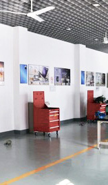
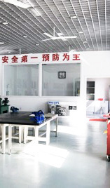

# 学生创新中心
学生创新中心由学生工程中心改建而成。在这里,有许多先进的设备可供使用,学生可以自由地完成并讨论他们的工程项目。学生创新中心旨在培养学生的技术创新能力和实践能力。

# 集思空间
为了满足各院校和院系的需求,集思空间为学生提供一个开放的、共享的、公共的平台。为了满足不同的需求,集思空间设置了各种功能区,如讨论区、加工区和展览区。

密西根学院以“学生会”技术部名义在实验室申请了一个地方,实现了工程训练中心与我院联合工程的对接。同时,未来会有更多的资源和设备为有创意的学生提供。

