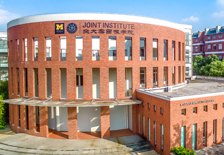
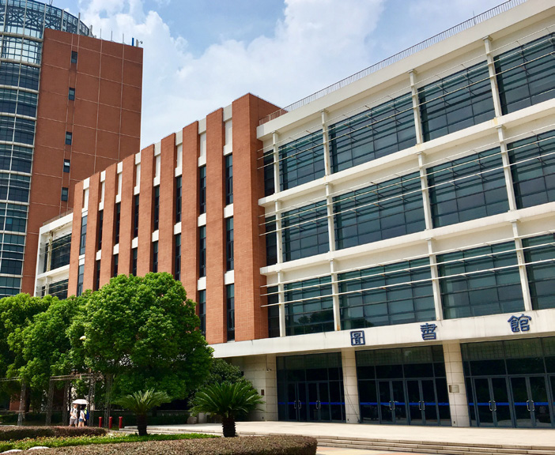

# 常用场所简介

## 电子阅览室和俞黎明学生中心
电阅(电子阅览室)和俞黎明学生中心都在密院楼内,电阅在二楼,俞黎明中心在三楼。它们都是密院学生自习、写作业、讨论的好去处,因为那里有充足的桌椅、供电插头(给电脑充电)、带有 VPN 的 Wi-Fi、小组讨论室、可免费使用的电脑。那里的开放时间也很长,一直到晚上十二点。TA(课程助教)们也经常在这两个地方开设 RC(复习课),因此在电阅或者俞黎明碰到他们,更可以向他们请教各种问题。除此之外,Advising Center 和 Writing Center 都在俞黎明学生中心。

## 密院一楼报告厅
密院一楼报告厅,是一个开设密院大型讲座、举办大型活动的地方。

## 交大新图书馆
占地 35,000 平方米,拥有四层,每层三个主馆(A, B, C 馆),新图为全交大的师生提供桌椅 3600 多套以供学习。那里还有安静学习区、小组讨论室(需提前租借)、多媒体教室等等。全家便利店以及创客空间咖啡厅都在新图书馆,为学习环境增添了一丝温馨的生活气息。

