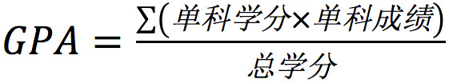

# 诚信守则和平均绩点
学术诚信是交大密西根学院的一项核心原则。为了给学生们提供一套标准学术诚信规范,密西根学院采用了由密西根大学引来的诚信守则(HonorCode)。

## 诚信守则
诚信守则是用来支持和实行一些密西根学院的课程政策的。学生们应自行理解诚信守则和它的执行方式。诚信守则在包括但不限于下列项目中适用:

- 考试,测验以及课堂作业;
- 课程作业以及引文的标注;
- 协作的小组项目;
- 大学文档;
- 电脑账户和软件;
- 非学术的违反行为。

如果想要了解更加细致的判定范围,请浏览这个网址:[http://umji.sjtu.edu.cn/academics/academic-integrity/honor-code/](http://umji.sjtu.edu.cn/academics/academic-integrity/honor-code/)

## 诚信委员会
诚信委员会完全由密西根学院学生组成,主要目的是调查可能违反诚信守则的案件。诚信委员会调查每个涉嫌 违反诚信守则的案件并决定是否存在违反诚信守则的行为,其最终决定以及处罚建议提交至教师纪律委员会。

## 教师纪律委员会 (FCD)
教师纪律委员会由密西根学院教师组成,其主要目的是决定违反诚信守则的学生的惩罚措施,最终惩罚措施的决定将参考诚信委员会的惩罚建议。想要了解更多信息,请浏览以下网址:

[http://umji.sjtu.edu.cn/academics/academic-integrity/](http://umji.sjtu.edu.cn/academics/academic-integrity/)

诚信守则是密西根学院与交大其他学院不同的特别规则。无论你有意或无意违反了诚信守则,你都会被严重地惩处。因此,强烈建议每位新生阅读诚信守则的详细准则。

## 平均绩点
平均绩点(GPA)是学生学业成绩的标准。它和课程得分的换算和它的计算方式如表格和公式所示。

| 等第 | 分数 |
| :---: | :---: |
| A+ | 4.0 |
| A  | 4.0 |
| A- | 3.7 |
| B+ | 3.3 |
| B  | 3.0 |
| B- | 2.7 |
| C+ | 2.3 |
| C  | 2.0 |
| C- | 1.7 |
| D  | 1.0 |
| F (Fail) | 0 |
| U (Uncompleted) | 0 |
| N (Null, absent) | 0 |

