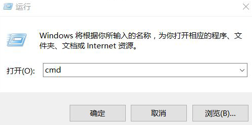
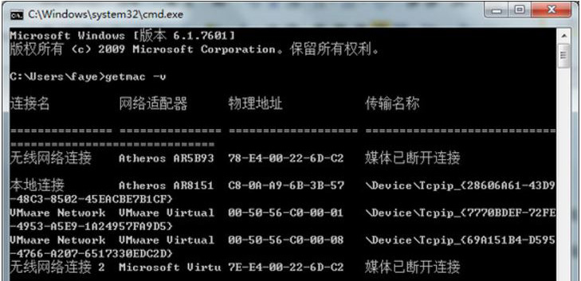
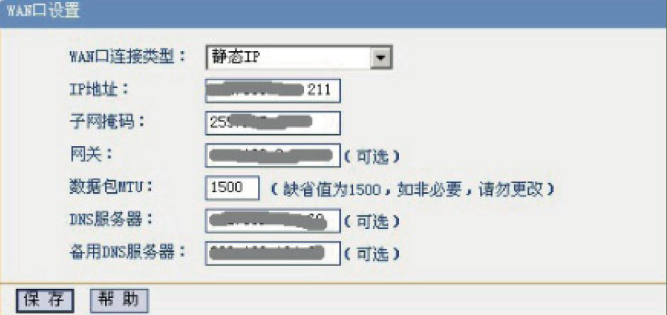
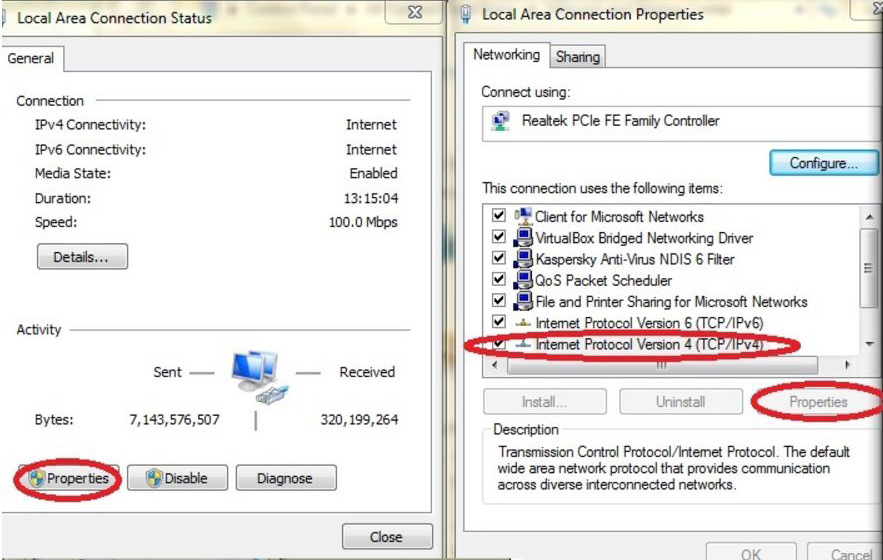
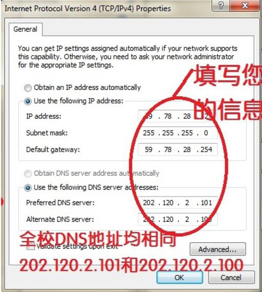

# 开网指南

电子版的中文开网指南请见：[http://nimo.sjtu.edu.cn/aton/index.php?g=Home&m=Index&a=applyguide](http://nimo.sjtu.edu.cn/aton/index.php?g=Home&m=Index&a=applyguide)

## 获取自己笔记本电脑网卡物理地址 (MAC 地址)

1. 打开运行对话框(快捷键 WIN+R);
2. 在运行窗口输入“cmd”,回车;

3. 在命令行中输入“getmac -v”,并回车 ( 注意 c 和 - 中间有空格);
4. 查询本地连接的 mac 地址。(本例中为 c8-0a-a9-6b-3b-57)。

## 访问 nimo 并申请开网

1. 访 问 [http://nimo.sjtu.edu.cn/](http://nimo.sjtu.edu.cn/) 并 点击“申请开网”。
2. 点击申请新地址。
3. 如需要授权获取 Jaccount 信息,请选择允许。此后按照右图页面的指示如实填写资料。
4. 确认信息填写正确后点击“申请开通”。出现添加成功后关闭窗口即完成申请开网操作,请耐心等待一到三个工作日后登陆本网站首页的信息查询,查询自己申请到的 ip 地址、网关等信息。

## 连网
1. 如果寝室中三到四个人需要共享网络,请查询各自的路由器的使用指南。注意这里的 WAN 口连接类型必须是“静态 IP“。其他需要填写的信息都可以在第六步中找到。

2. 如果寝室中只有一个人需要联网(基本不会发生),请将自己申请到的 ip 地址和网关等信息填入本地连接的属性中。具体方法为:

win7 用户:控制面板 - 网络和 internet- 网络连接 - 本地连接 - 右击选择属性 - 选
中 internet 协议版本 4(TCP/IPv4)- 点击属性 - 正确填写即可。

