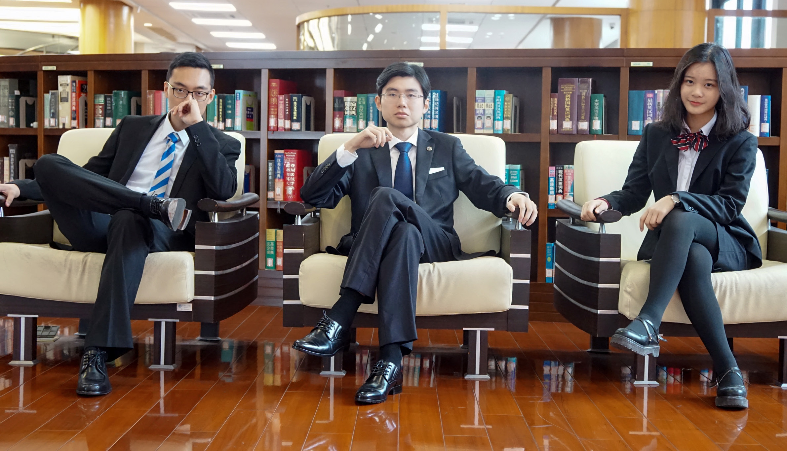
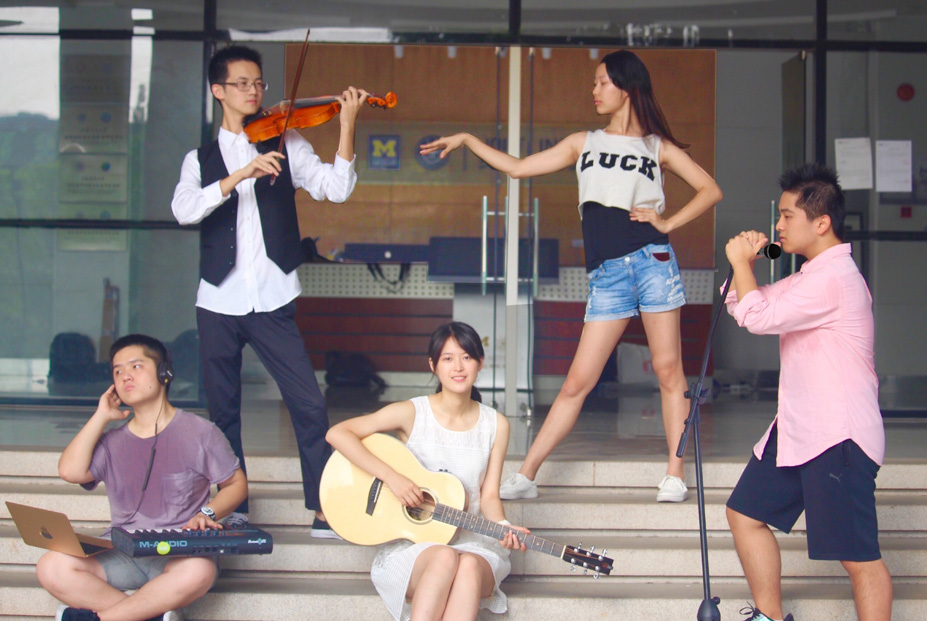
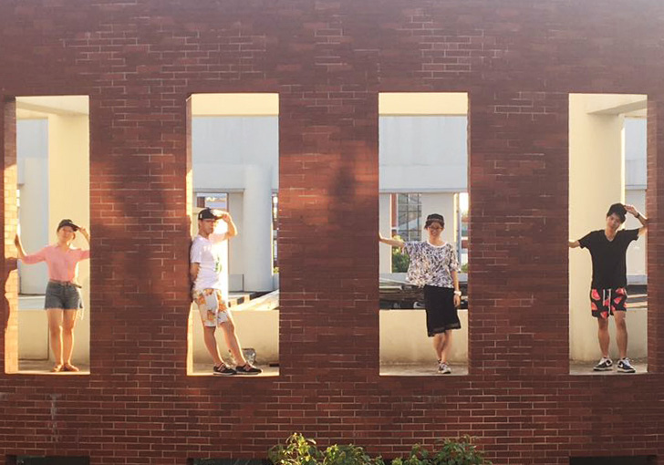
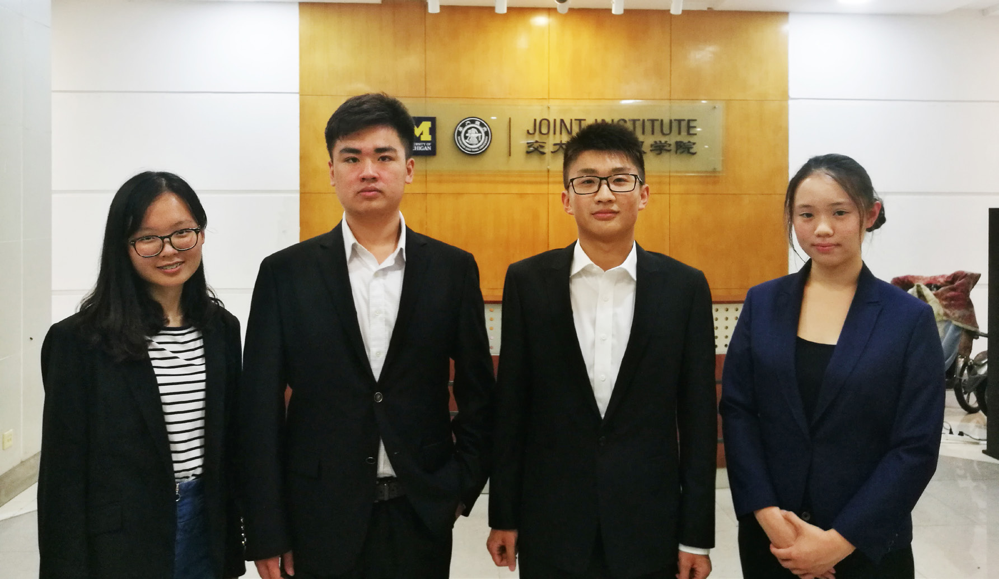
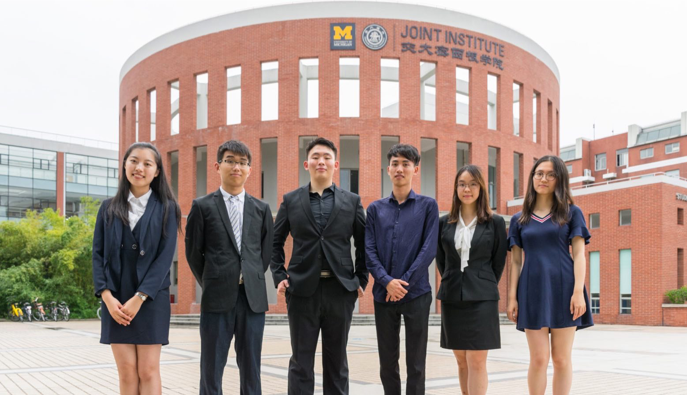
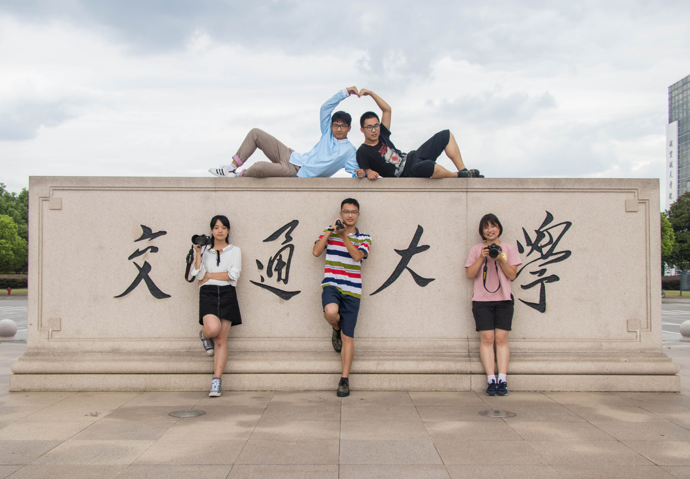
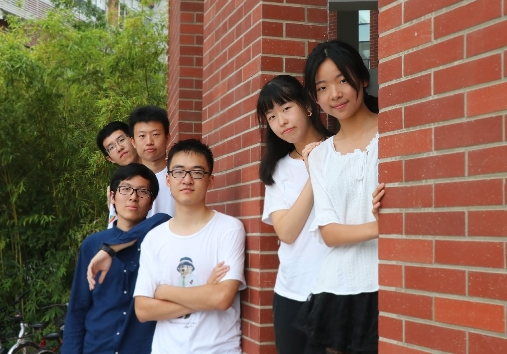
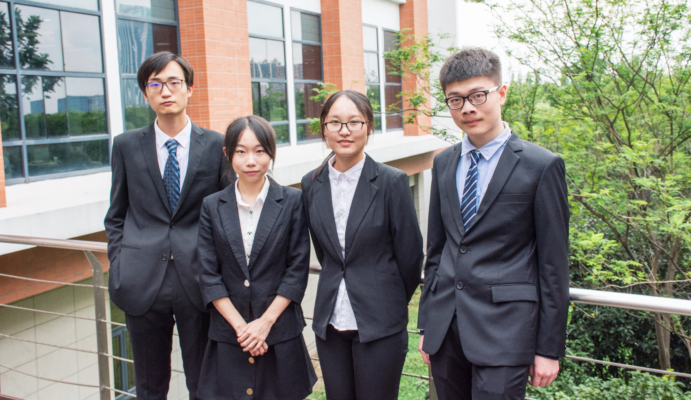
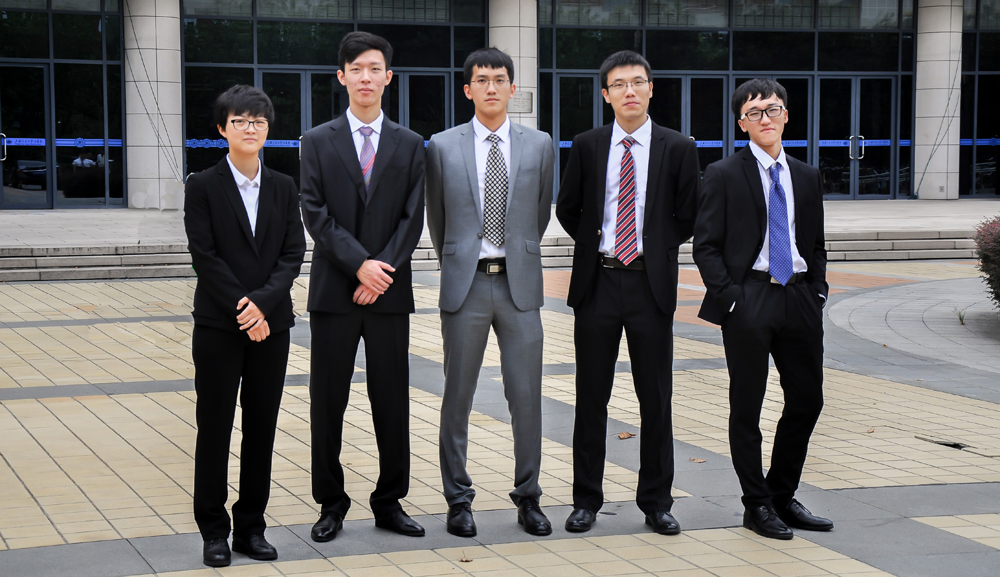
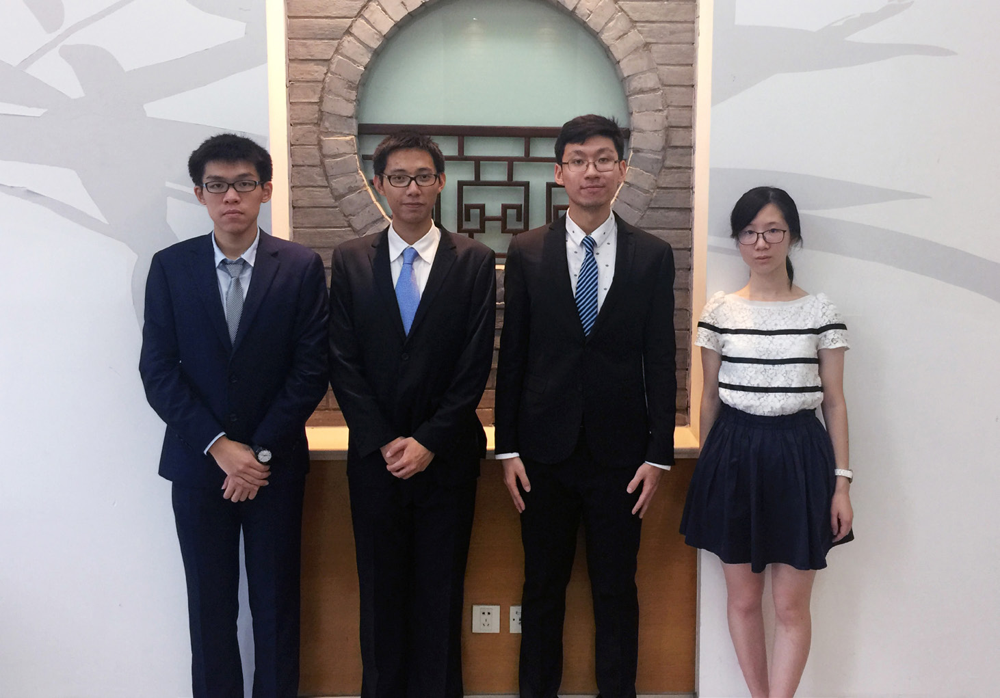

# 密院学生会简介

密西根学院学生会是在学院党委领导和团委指导下，代表上海交通大学密西根学院全体本科学生的群众组织，其宗旨是代表全体学生的利益并全心全意为其服务。学生会的权力机关为学院学生代表大会及其常务委员会，执行机构为学生会主席团及其领导下的九大部门。

## 主席团

### 简介

学生会主席团作为学生会在学代会闭会期间的最高执行机构，全面负责学院学生会工作。本届学生会主席团由密院第十二次学代会选举产生，践行“以同学为本，以务实为基，以创新为旨，以公正为准，以交流为纽带，以进取为方向”的理念，坚持“代表同学，服务同学，引领同学”的宗旨，愿和全体密院学子一起不断向前，继往开来。

### 主席

陶元杰（中）

### 副主席

范哲良（左）
刘嘉晨（右）

## 文艺部

### 简介

文艺部主要承办密院大型文艺活动，致力于为密院学子的生活增添艺术气息，为对爱好文艺和具有文艺特长的同学们一个展示的平台。每年，文艺部会承办新生迎新晚会，圣诞舞会，密院歌手大赛等常规活动。同时，文艺部每年也会推出创新活动，以展现密院学子的别样风采。文艺部是一个温馨和谐的大家庭，部员在其中迸发灵感，追求艺术的高度。我们在这盛放的青春里一起做梦，倒进狂热！欢迎加入文艺部JI ARTTACK 2017 ！

### 部长

朱丰昱（下中）

### 副部长

谢舒翔（上左）
麻珂睿（上右）
李睿 （下左）
张子虓（下右）

## 事业部

### 简介

事业部，一个搞“实业”的部门。我们每年会举办多次“企业参观”活动，与知名企业对接参观，与业界大佬面对面；我们有一本王牌杂志“启程在JI”，给大一新生照亮在大学前行的道路。今年起，我们还将与校友会对接，策划一系列校友活动；运营“JI-CAREER”密西根学院职业发展中心公众号，掌握宝贵的第一手职业资源信息。加入事业部，让你的大学生活赢在起跑线上。

### 部长

赵文珲（左二）

### 副部长

冯姝婉（左一）
石一茗（右二）
柯正 （ 右一）

## 社团部

### 简介

社团部是一个统一管理社团并为社团活动提供平台的组织，主要负责社团组建的管理，对社团活动的支持和社团联合活动（例如社团招新，社团嘉年华，中秋晚会等）的承办。今年社团部将新增对优秀社团的奖励表彰机制以鼓励社团活动。

### 部长

吴林霄（左二）

### 副部长

王朱翥（左一）
艾雨晨（右二）
Marina Chen（右一)

## 外联部

### 简介

外联部作为学生会最庞大的部门，有三个部分组成：赞助组，联谊组和联院小铺。

赞助组负责与企业的联系和沟通，以为学生会大部分活动提供赞助和支持。如果你对与企业高层交流感兴趣，想要锻炼你的沟通技巧，或者自信于自己从无到有的本领，赞助组值得你考虑！

联谊组负责与其他院系或者其他高校的联谊交流活动。联谊组举办过侦探游戏，自制寿司，军训晚会等各种精彩纷呈的活动。说不定在发挥你天马行空的创造力举办联谊活动的同时，你也能找到属于自己的真爱～

联院小铺作为学生会一大特色，经营售卖各种密院纪念品。加入小铺，设计你自己的产品，经营你自己的商铺，向大家一起宣扬密院的文化吧！

### 部长

陈嘉懿（左一）

### 副部长

彭晨 （左二）
薛霖铠（左三）
苏浩雄（右三）
孙雨岑（右二）
朱元坤（右一）

## 新闻部

### 简介

新闻部是一个充满创意与热情的部门。我们用照片记录下密院的每一个角落，我们通过微电影展现想象的天马行空，我们以笔墨挥洒思维的广与深。我们虽然不在舞台上，但是我们让聚光灯照在每个密院人的身上。

在这里，你有机会参与并用相机、用文字记录密院举办的每个活动，能够制作一本专属于我们的院刊《联愿》，也能够策划筹备发布密院特色的《新闻联播》。所以，欢迎加入我们。

### 部长

刘启鸿（上右）

### 副部长

朱泽昊（上左）
张玥 （下左）
阮智浩（下中）
王博文（下右）

## 内联部

### 简介

内联部为学生会系统的循环中枢，负责加强学生与教授、学院行政机构、学生会的沟通交流。内联部将带领学生们倾听教授的经验；把学生们的建议、疑惑上达给学院，并将学院回复反馈给学生，形成一条沟通链，以促进学院发展；同时，内联部还将加强学生会每个部门之间的联络，使各部门间的合作更为高效。

### 部长

郑思仪（前一）

### 副部长

杨瑞敏（后一）
邓珺玮（后二）
吴明远（后三）
刘书恒（前三）
钱敏佳（前二）

## 宣传部

### 简介

我们是宣传部( 幕后团)。

我们有密院最专业的平面设计师和影片剪辑师。

我们出色完成密院活动的一切宣传工作。

我们组织举办表情设计大赛和MAD大赛。

我们为所有密院人开设Ps讲座和视频剪辑讲座。

想知道如何亲手制作出酷炫的海报吗？

想实现当导演的梦想吗？

想加入一个团结友爱的大家庭吗？

不论你是新手还是专家，只要你有参加宣传工作的热情，我们都热烈欢迎！

加入我们吧！9月，我们不见不散！

### 部长

胡誉文（右二）

### 副部长

孙琦岳（左一）
王嫣然（左二）
杜轲 （右一）

## 体育部

### 简介

体育部主要负责组织足球、篮球、羽毛球等各个项目的体育活动。在学业相对轻松的春季，体育部将组织密院杯系列比赛，项目包括传统的球类项目以及电子竞技。每一位加入体育部的新生都将至少组织并主持一场比赛。除了院内的比赛之外，体育部也主持许多院间比赛例如希望杯足球赛和体总杯羽毛球、篮球赛。

### 部长

刘倪逸秋（右二）

### 副部长

李雨姗 （左一）
彭思源 （左二）
曾繁昊 （左三）
黄天淳 （右一）

## 技术部

### 简介

技术部旨在为密西根学院所有学生提供最基础的技术支持，并为学生在学习过程中使用的相关软件如latex提供教学指导。同时技术部也会举办一些有趣的活动例如DIY键盘以丰富同学的课余生活。

### 部长

金旻昊（左二）

### 副部长

王天予（左一）
贾治峰（右二）
张怡斐（右一）

